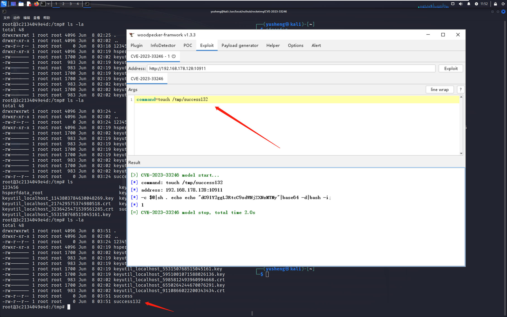

# 0x01 简介

此工具是一款用于 RocketMQ RCE (CVE-2023-33246) woodpecker 利用插件。目前不支持回显。由于 woodpecker 不支持无协议头地址，输入地址请加上协议头。

# 0x02 演示

# 0x03 参考文献
- https://github.com/vulhub/vulhub/blob/master/rocketmq/CVE-2023-33246/README.zh-cn.md
